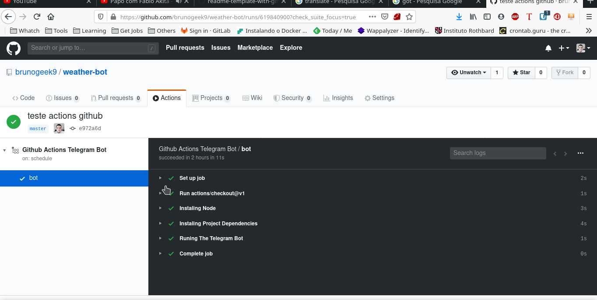

<h1 align="center">
 
  
 
 
WEATER BOT
</h1>

Weather forecast bot implemented with javascript and github actions. 

  
  
  
  
  

  

## Features
- **dotenv** — A JavaScript library for using environment variables
- **node-telegram-bot-api** — A lib that provides a way to send messages to the telegram
- **node-fetch** — Provide access to the fetch api on the backend

## Getting started

<ul>
  <li>
  
  `npm install`
  
  </li>
  
  <li>
  

    After installing the packages you must create the following variables in your .env file and put your credentials 
    <kbd>WEATHER_API_TOKEN</kbd>, <kbd>TELEGRAM_TOKEN</kbd> and <kbd>CHAT_ID</kbd>.
  

  </li>

  
</ul>
  
## License

This project is licensed under the MIT License - see the [LICENSE](https://opensource.org/licenses/MIT) page for details.